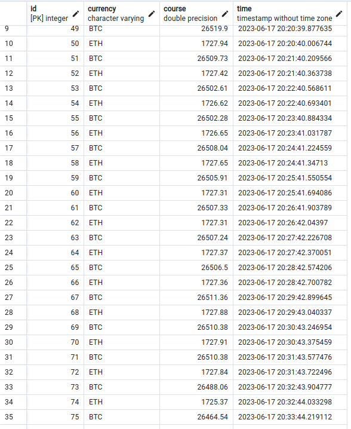

## This app shows the crypto Curses ETH and BTC every 60 seconds from CryptoExchange Deribit and saving this in SqlAlchemy Database

# Technology stack:
- Python 3.10.6
- FastApi 0.95.0
- Asyncio, aiohttp - 3.4.3, 3.8.4 
- SqlAlchemy Database and Postgres - 2.0.16, 2.9.6
- docker compose - 1.29.2
- JSON - 3.2.0

# Main

- for using this project go to env file and enter your data
- Enjoy!

